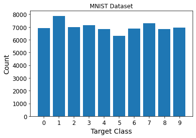
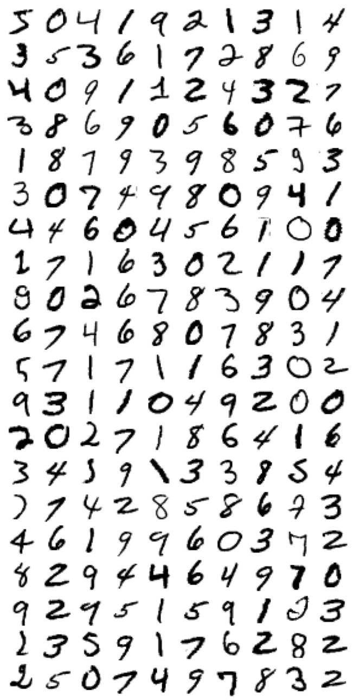

This post discusses training a binary classifier on the MNIST dataset.

<pre>import os
%matplotlib inline
import matplotlib as mpl
import matplotlib.pyplot as plt
mpl.rc(&#39;axes&#39;, labelsize=14)
mpl.rc(&#39;xtick&#39;, labelsize=12)
mpl.rc(&#39;ytick&#39;, labelsize=12)
# Where to save the figures
PROJECT_ROOT_DIR = &quot;.&quot;
NOTEBOOK_NAME = &quot;binary-classifier&quot;
IMAGES_PATH = os.path.join(PROJECT_ROOT_DIR, &quot;images&quot;, NOTEBOOK_NAME)
os.makedirs(IMAGES_PATH, exist_ok=True)  def save_fig(fig_id, tight_layout=True, fig_extension=&quot;png&quot;, resolution=300):
    path = os.path.join(IMAGES_PATH, fig_id + &quot;.&quot; + fig_extension)
    print(&quot;Saving figure&quot;, fig_id)
    if tight_layout:
        plt.tight_layout()
    plt.savefig(path, format=fig_extension, dpi=resolution)
</pre>

The following takes a little over 1 minute to complete.

<pre># fetch the MNIST dataset
from sklearn.datasets import fetch_openml
mnist = fetch_openml(&#39;mnist_784&#39;, version=1, as_frame=False)
mnist.keys()
</pre>

    dict_keys(['data', 'target', 'frame', 'categories', 'feature_names', 'target_names', 'DESCR', 'details', 'url'])

Let's look at the data shape.

<pre>X, y = mnist[&quot;data&quot;], mnist[&quot;target&quot;]
X.shape
</pre>

    (70000, 784)

<pre>y.shape
</pre>

    (70000,)

<pre>28 * 28
</pre>

    784

The above shows that there are 70,000 images and that each picture has 784 features. The reason for this is that each image is 28x28 pixels. Each column represents one pixel's intensity from 0 (white) to 255 (black).

<pre>X.dtype
</pre>

    dtype('float64')

<pre>dt = y.dtype
dt
</pre>

    dtype('O')

<pre>dt.itemsize
</pre>

    8

<pre>dt.name
</pre>

    'object'

<pre>print(*[[feature for feature in mnist.feature_names][:5],[feature for feature in mnist.feature_names][-5:]])
</pre>

    ['pixel1', 'pixel2', 'pixel3', 'pixel4', 'pixel5'] ['pixel780', 'pixel781', 'pixel782', 'pixel783', 'pixel784']

<pre>import pandas as pd
pd.DataFrame(mnist.data[0:1], columns=mnist.feature_names)
</pre>

<table border="1" class="dataframe">
  <thead>
    <tr style="text-align: right;">
      <th></th>
      <th>pixel1</th>
      <th>pixel2</th>
      <th>pixel3</th>
      <th>pixel4</th>
      <th>pixel5</th>
      <th>pixel6</th>
      <th>pixel7</th>
      <th>pixel8</th>
      <th>pixel9</th>
      <th>pixel10</th>
      <th>...</th>
      <th>pixel775</th>
      <th>pixel776</th>
      <th>pixel777</th>
      <th>pixel778</th>
      <th>pixel779</th>
      <th>pixel780</th>
      <th>pixel781</th>
      <th>pixel782</th>
      <th>pixel783</th>
      <th>pixel784</th>
    </tr>
  </thead>
  <tbody>
    <tr>
      <th>0</th>
      <td>0.0</td>
      <td>0.0</td>
      <td>0.0</td>
      <td>0.0</td>
      <td>0.0</td>
      <td>0.0</td>
      <td>0.0</td>
      <td>0.0</td>
      <td>0.0</td>
      <td>0.0</td>
      <td>...</td>
      <td>0.0</td>
      <td>0.0</td>
      <td>0.0</td>
      <td>0.0</td>
      <td>0.0</td>
      <td>0.0</td>
      <td>0.0</td>
      <td>0.0</td>
      <td>0.0</td>
      <td>0.0</td>
    </tr>
  </tbody>
</table>

1 rows × 784 columns

<pre>import numpy as np
unique, counts = np.unique(y, return_counts=True)
print(np.c_[unique, counts])
plt.bar(unique, counts)
plt.title(&#39;MNIST Dataset&#39;)
plt.xlabel(&#39;Target Class&#39;)
plt.ylabel(&#39;Count&#39;)
plt.show()
</pre>

    [['0' 6903]
     ['1' 7877]
     ['2' 6990]
     ['3' 7141]
     ['4' 6824]
     ['5' 6313]
     ['6' 6876]
     ['7' 7293]
     ['8' 6825]
     ['9' 6958]]

Let's print one of the digits.

<pre>%matplotlib inline
import matplotlib as mpl
import matplotlib.pyplot as plt  some_digit = X[0]
some_digit_image = some_digit.reshape(28, 28)
plt.imshow(some_digit_image, cmap=mpl.cm.binary)
plt.axis(&quot;off&quot;)  save_fig(&quot;some_digit_plot&quot;)
plt.show()
</pre>

    Saving figure some_digit_plot

<pre>y[0]
</pre>

    '5'

<pre>y = y.astype(np.uint8)
</pre>

Let's look at some more images from the dataset.

<pre>def plot_digits(instances, images_per_row=10, **options):
    size = 28
    images_per_row = min(len(instances), images_per_row)
    # This is equivalent to n_rows = ceil(len(instances) / images_per_row):
    n_rows = (len(instances) - 1) // images_per_row + 1      # Append empty images to fill the end of the grid, if needed:
    n_empty = n_rows * images_per_row - len(instances)
    padded_instances = np.concatenate([instances, np.zeros((n_empty, size * size))], axis=0)      # Reshape the array so it&#39;s organized as a grid containing 28×28 images:
    image_grid = padded_instances.reshape((n_rows, images_per_row, size, size))      # Combine axes 0 and 2 (vertical image grid axis, and vertical image axis),
    # and axes 1 and 3 (horizontal axes). We first need to move the axes that we
    # want to combine next to each other, using transpose(), and only then we
    # can reshape:
    big_image = image_grid.transpose(0, 2, 1, 3).reshape(n_rows * size,
                                                         images_per_row * size)
    # Now that we have a big image, we just need to show it:
    plt.imshow(big_image, cmap = mpl.cm.binary, **options)
    plt.axis(&quot;off&quot;)
</pre>

<pre>plt.figure(figsize=(18,18))
example_images = X[0:200]
plot_digits(example_images, images_per_row=10)
save_fig(&quot;more_digits_plot&quot;)
plt.show()
</pre>

    Saving figure more_digits_plot

The MNIST dataset is split into a training (the first 60,000 images) and a test set (the last 10,000 images).

<pre>X_train, X_test, y_train, y_test = X[:60000], X[60000:], y[:60000], y[60000:]
</pre>

Next, we shuffle the training set, guaranteeing that all cross-validation folds are similar and not missing any digits. Also, some algorithms are sensitive to the order of training instances. However, shuffling is bad when working on time-series data, such as stock market prices and weather conditions.

<pre>np.random.seed(42)
shuffle_index = np.random.permutation(60000)
shuffle_index
</pre>

    array([12628, 37730, 39991, ...,   860, 15795, 56422])

<pre>X_train, y_train = X_train[shuffle_index], y_train[shuffle_index]
%store X_train X_test y_train y_test
</pre>

    Stored 'X_train' (ndarray)
    Stored 'X_test' (ndarray)
    Stored 'y_train' (ndarray)
    Stored 'y_test' (ndarray)

Let's simplify the problem and only try to identify the number five, an example of a *binary classifier*. Binary classifiers distinguish between just two classes. In this instance, five and not five. We need to create target vectors for the classification task.

The below code creates a boolean NumPy array for both the training and test sets.

<pre>y_train_5 = (y_train == 5)
y_test_5 = (y_test == 5)
print(type(y_train_5))
print(type(y_test_5))  %store y_train_5 y_test_5
</pre>

    <class 'numpy.ndarray'>
    <class 'numpy.ndarray'>
    Stored 'y_train_5' (ndarray)
    Stored 'y_test_5' (ndarray)

Let's use `np.flatnonzero()` to check that we correctly set up the boolean NumPy arrays for the target variable in both training and test sets. `np.flatnonzero()` returns indices of the non-zero elements of an input array and is equivalent to `np.nonzero(np.ravel(a))[0]`. `np.ravel()` returns a 1-D array containing the input array elements.

<pre># the indices of the true values in the y_train_5 NumPy array
np.flatnonzero(y_train_5)
</pre>

    array([    8,    11,    25, ..., 59928, 59942, 59965], dtype=int64)

Let's confirm the values that we expect to be true are true and vice versa.

<pre>y_train_5[[7, 8, 11, 25, 26]]
</pre>

    array([False,  True,  True,  True, False])

We can use `np.concatenate()` to look at the test dataset's first five and last five indices.

<pre>y_test_5 = (y_test == 5)
np.concatenate((np.flatnonzero(y_test_5)[:5], np.flatnonzero(y_test_5)[-5:]))
</pre>

    array([   8,   15,   23,   45,   52, 9941, 9970, 9982, 9988, 9998],
          dtype=int64)

Again, let's confirm these indices give us the values we expect.

<pre>y_test_5[[8, 9, 23, 26, 9941, 9970]]
</pre>

    array([ True, False,  True, False,  True,  True])

Now we can pick a classifier and train it. *Stochastic Gradient Descent* (SGD) is a good place to start. The classifier can handle very large datasets efficiently since it deals with training instances independently, one at a time, making SGD well suited for _online learning_. Let's create an `SGDClassifier` and train it on the whole training set.

<pre>from sklearn.linear_model import SGDClassifier
sgd_clf = SGDClassifier(random_state=42)
sgd_clf.fit(X_train, y_train_5)
%store sgd_clf
</pre>

    Stored 'sgd_clf' (SGDClassifier)

Now you can use the classifier to detect images of the number 5:

<pre>sgd_clf.predict([some_digit])
</pre>

    array([ True])

In this case, the classifier guesses correct. The image represents a 5. Let's print the digit once more so that we remember.

<pre>plt.imshow(some_digit_image, cmap=mpl.cm.binary)
plt.axis(&quot;off&quot;)
plt.show()
</pre>

 We will evaluate the model's performance more closely in the next post.
