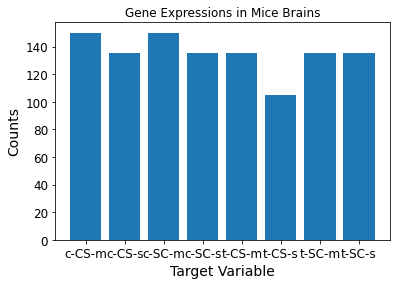

---

This post talks about importing datasets from [Scikit-Learn](https://scikit-learn.org/).

Let's import the `datasets` package. Also, we import NumPy to use the `np.unique()` function and others later.


<div class="highlight"><pre><span></span><span class="kn">from</span> <span class="nn">sklearn</span> <span class="kn">import</span> <span class="n">datasets</span>
<span class="kn">import</span> <span class="nn">numpy</span> <span class="k">as</span> <span class="nn">np</span>
</pre></div>


By running `dir(datasets)`, we see all the functions associated with this package.


<div class="highlight"><pre><span></span><span class="nb">print</span><span class="p">(</span><span class="o">*</span><span class="p">[</span><span class="n">data</span> <span class="k">for</span> <span class="n">data</span> <span class="ow">in</span> <span class="nb">dir</span><span class="p">(</span><span class="n">datasets</span><span class="p">)</span> <span class="k">if</span> <span class="ow">not</span> <span class="n">data</span><span class="o">.</span><span class="n">startswith</span><span class="p">(</span><span class="s1">&#39;_&#39;</span><span class="p">)])</span>
</pre></div>


    clear_data_home dump_svmlight_file fetch_20newsgroups fetch_20newsgroups_vectorized fetch_california_housing fetch_covtype fetch_kddcup99 fetch_lfw_pairs fetch_lfw_people fetch_olivetti_faces fetch_openml fetch_rcv1 fetch_species_distributions get_data_home load_boston load_breast_cancer load_diabetes load_digits load_files load_iris load_linnerud load_sample_image load_sample_images load_svmlight_file load_svmlight_files load_wine make_biclusters make_blobs make_checkerboard make_circles make_classification make_friedman1 make_friedman2 make_friedman3 make_gaussian_quantiles make_hastie_10_2 make_low_rank_matrix make_moons make_multilabel_classification make_regression make_s_curve make_sparse_coded_signal make_sparse_spd_matrix make_sparse_uncorrelated make_spd_matrix make_swiss_roll


You can use the datasets prefixed with `load` to load small, standard datasets, otherwise known as toy datasets. On the other hand, you can use the datasets prefixed with the word `fetch` to download and load larger datasets more similar to real-world datasets.

Loaders and fetchers return a [Bunch](https://scikit-learn.org/stable/modules/generated/sklearn.utils.Bunch.html?highlight=bunch#sklearn.utils.Bunch) object, a dictionary that exposes its keys as attributes.

The functions prefixed with `make` are the dataset generation functions. We use these to create controlled, synthetic datasets. The functions return a tuple `(X, y)` consisting of a `n_samples` * `n_features` NumPy array `X` and an array of length `n_samples` containing the targets `y`.

Finally, we can download datasets from the [openml.org](https://openml.org/) repository. [Openml.org](https://openml.org/) is a public repository for machine learning that allows one to upload open datasets.

Say we were interested in downloading a dataset of the gene expressions in mice brains. We need to provide a name and a version to fully specify a dataset, though the version argument is optional.


<div class="highlight"><pre><span></span><span class="kn">from</span> <span class="nn">sklearn.datasets</span> <span class="kn">import</span> <span class="n">fetch_openml</span>
<span class="n">mice</span> <span class="o">=</span> <span class="n">fetch_openml</span><span class="p">(</span><span class="n">name</span><span class="o">=</span><span class="s1">&#39;miceprotein&#39;</span><span class="p">,</span> <span class="n">version</span><span class="o">=</span><span class="mi">4</span><span class="p">)</span>
</pre></div>


Let's learn more about this dataset.


<div class="highlight"><pre><span></span><span class="nb">print</span><span class="p">(</span><span class="s1">&#39;---------------&#39;</span><span class="p">)</span>
<span class="nb">print</span><span class="p">(</span><span class="s1">&#39;Description&#39;</span><span class="p">)</span>
<span class="nb">print</span><span class="p">(</span><span class="s1">&#39;---------------&#39;</span><span class="p">)</span>
<span class="nb">print</span><span class="p">(</span><span class="n">mice</span><span class="o">.</span><span class="n">DESCR</span><span class="p">)</span>
<span class="nb">print</span><span class="p">(</span><span class="s1">&#39;---------------&#39;</span><span class="p">)</span>
<span class="nb">print</span><span class="p">(</span><span class="s1">&#39;Feature Names&#39;</span><span class="p">)</span>
<span class="nb">print</span><span class="p">(</span><span class="s1">&#39;---------------&#39;</span><span class="p">)</span>
<span class="nb">print</span><span class="p">(</span><span class="n">mice</span><span class="o">.</span><span class="n">feature_names</span><span class="p">)</span>
<span class="nb">print</span><span class="p">(</span><span class="s1">&#39;---------------&#39;</span><span class="p">)</span>
<span class="nb">print</span><span class="p">(</span><span class="s1">&#39;Target Names&#39;</span><span class="p">)</span>
<span class="nb">print</span><span class="p">(</span><span class="s1">&#39;---------------&#39;</span><span class="p">)</span>
<span class="nb">print</span><span class="p">(</span><span class="n">mice</span><span class="o">.</span><span class="n">target_names</span><span class="p">)</span>
<span class="nb">print</span><span class="p">(</span><span class="s1">&#39;---------------&#39;</span><span class="p">)</span>
<span class="nb">print</span><span class="p">(</span><span class="s1">&#39;Data&#39;</span><span class="p">)</span>
<span class="nb">print</span><span class="p">(</span><span class="s1">&#39;---------------&#39;</span><span class="p">)</span>
<span class="nb">print</span><span class="p">(</span><span class="n">mice</span><span class="o">.</span><span class="n">data</span><span class="p">)</span>
<span class="nb">print</span><span class="p">(</span><span class="s1">&#39;---------------&#39;</span><span class="p">)</span>
<span class="nb">print</span><span class="p">(</span><span class="s1">&#39;Details&#39;</span><span class="p">)</span>
<span class="nb">print</span><span class="p">(</span><span class="s1">&#39;---------------&#39;</span><span class="p">)</span>
<span class="nb">print</span><span class="p">(</span><span class="n">mice</span><span class="o">.</span><span class="n">details</span><span class="p">)</span>
<span class="nb">print</span><span class="p">(</span><span class="s1">&#39;---------------&#39;</span><span class="p">)</span>
<span class="nb">print</span><span class="p">(</span><span class="s1">&#39;URL&#39;</span><span class="p">)</span>
<span class="nb">print</span><span class="p">(</span><span class="s1">&#39;---------------&#39;</span><span class="p">)</span>
<span class="nb">print</span><span class="p">(</span><span class="n">mice</span><span class="o">.</span><span class="n">url</span><span class="p">)</span>
</pre></div>


    ---------------
    Description
    ---------------
    **Author**: Clara Higuera, Katheleen J. Gardiner, Krzysztof J. Cios
    **Source**: [UCI](https://archive.ics.uci.edu/ml/datasets/Mice+Protein+Expression) - 2015
    **Please cite**: Higuera C, Gardiner KJ, Cios KJ (2015) Self-Organizing Feature Maps Identify Proteins Critical to Learning in a Mouse Model of Down Syndrome. PLoS ONE 10(6): e0129126.

    Expression levels of 77 proteins measured in the cerebral cortex of 8 classes of control and Down syndrome mice exposed to context fear conditioning, a task used to assess associative learning.

    The data set consists of the expression levels of 77 proteins/protein modifications that produced detectable signals in the nuclear fraction of cortex. There are 38 control mice and 34 trisomic mice (Down syndrome), for a total of 72 mice. In the experiments, 15 measurements were registered of each protein per sample/mouse. Therefore, for control mice, there are 38x15, or 570 measurements, and for trisomic mice, there are 34x15, or 510 measurements. The dataset contains a total of 1080 measurements per protein. Each measurement can be considered as an independent sample/mouse.

    The eight classes of mice are described based on features such as genotype, behavior and treatment. According to genotype, mice can be control or trisomic. According to behavior, some mice have been stimulated to learn (context-shock) and others have not (shock-context) and in order to assess the effect of the drug memantine in recovering the ability to learn in trisomic mice, some mice have been injected with the drug and others have not.

    Classes:
    ```
    * c-CS-s: control mice, stimulated to learn, injected with saline (9 mice)
    * c-CS-m: control mice, stimulated to learn, injected with memantine (10 mice)
    * c-SC-s: control mice, not stimulated to learn, injected with saline (9 mice)
    * c-SC-m: control mice, not stimulated to learn, injected with memantine (10 mice)
    * t-CS-s: trisomy mice, stimulated to learn, injected with saline (7 mice)
    * t-CS-m: trisomy mice, stimulated to learn, injected with memantine (9 mice)
    * t-SC-s: trisomy mice, not stimulated to learn, injected with saline (9 mice)
    * t-SC-m: trisomy mice, not stimulated to learn, injected with memantine (9 mice)
    ```

    The aim is to identify subsets of proteins that are discriminant between the classes.

    ### Attribute Information:

    ```
    1 Mouse ID
    2..78 Values of expression levels of 77 proteins; the names of proteins are followed by &acirc;&euro;&oelig;_n&acirc;&euro; indicating that they were measured in the nuclear fraction. For example: DYRK1A_n
    79 Genotype: control (c) or trisomy (t)
    80 Treatment type: memantine (m) or saline (s)
    81 Behavior: context-shock (CS) or shock-context (SC)
    82 Class: c-CS-s, c-CS-m, c-SC-s, c-SC-m, t-CS-s, t-CS-m, t-SC-s, t-SC-m
    ```

    ### Relevant Papers:

    Higuera C, Gardiner KJ, Cios KJ (2015) Self-Organizing Feature Maps Identify Proteins Critical to Learning in a Mouse Model of Down Syndrome. PLoS ONE 10(6): e0129126. [Web Link] journal.pone.0129126

    Ahmed MM, Dhanasekaran AR, Block A, Tong S, Costa ACS, Stasko M, et al. (2015) Protein Dynamics Associated with Failed and Rescued Learning in the Ts65Dn Mouse Model of Down Syndrome. PLoS ONE 10(3): e0119491.

    Downloaded from openml.org.
    ---------------
    Feature Names
    ---------------
    ['DYRK1A_N', 'ITSN1_N', 'BDNF_N', 'NR1_N', 'NR2A_N', 'pAKT_N', 'pBRAF_N', 'pCAMKII_N', 'pCREB_N', 'pELK_N', 'pERK_N', 'pJNK_N', 'PKCA_N', 'pMEK_N', 'pNR1_N', 'pNR2A_N', 'pNR2B_N', 'pPKCAB_N', 'pRSK_N', 'AKT_N', 'BRAF_N', 'CAMKII_N', 'CREB_N', 'ELK_N', 'ERK_N', 'GSK3B_N', 'JNK_N', 'MEK_N', 'TRKA_N', 'RSK_N', 'APP_N', 'Bcatenin_N', 'SOD1_N', 'MTOR_N', 'P38_N', 'pMTOR_N', 'DSCR1_N', 'AMPKA_N', 'NR2B_N', 'pNUMB_N', 'RAPTOR_N', 'TIAM1_N', 'pP70S6_N', 'NUMB_N', 'P70S6_N', 'pGSK3B_N', 'pPKCG_N', 'CDK5_N', 'S6_N', 'ADARB1_N', 'AcetylH3K9_N', 'RRP1_N', 'BAX_N', 'ARC_N', 'ERBB4_N', 'nNOS_N', 'Tau_N', 'GFAP_N', 'GluR3_N', 'GluR4_N', 'IL1B_N', 'P3525_N', 'pCASP9_N', 'PSD95_N', 'SNCA_N', 'Ubiquitin_N', 'pGSK3B_Tyr216_N', 'SHH_N', 'BAD_N', 'BCL2_N', 'pS6_N', 'pCFOS_N', 'SYP_N', 'H3AcK18_N', 'EGR1_N', 'H3MeK4_N', 'CaNA_N']
    ---------------
    Target Names
    ---------------
    ['class']
    ---------------
    Data
    ---------------
          DYRK1A_N   ITSN1_N    BDNF_N     NR1_N    NR2A_N    pAKT_N   pBRAF_N  \
    0     0.503644  0.747193  0.430175  2.816329  5.990152  0.218830  0.177565
    1     0.514617  0.689064  0.411770  2.789514  5.685038  0.211636  0.172817
    2     0.509183  0.730247  0.418309  2.687201  5.622059  0.209011  0.175722
    3     0.442107  0.617076  0.358626  2.466947  4.979503  0.222886  0.176463
    4     0.434940  0.617430  0.358802  2.365785  4.718679  0.213106  0.173627
    ...        ...       ...       ...       ...       ...       ...       ...
    1075  0.254860  0.463591  0.254860  2.092082  2.600035  0.211736  0.171262
    1076  0.272198  0.474163  0.251638  2.161390  2.801492  0.251274  0.182496
    1077  0.228700  0.395179  0.234118  1.733184  2.220852  0.220665  0.161435
    1078  0.221242  0.412894  0.243974  1.876347  2.384088  0.208897  0.173623
    1079  0.302626  0.461059  0.256564  2.092790  2.594348  0.251001  0.191811

          pCAMKII_N   pCREB_N    pELK_N  ...     SHH_N     BAD_N  BCL2_N  \
    0      2.373744  0.232224  1.750936  ...  0.188852  0.122652     NaN
    1      2.292150  0.226972  1.596377  ...  0.200404  0.116682     NaN
    2      2.283337  0.230247  1.561316  ...  0.193685  0.118508     NaN
    3      2.152301  0.207004  1.595086  ...  0.192112  0.132781     NaN
    4      2.134014  0.192158  1.504230  ...  0.205604  0.129954     NaN
    ...         ...       ...       ...  ...       ...       ...     ...
    1075   2.483740  0.207317  1.057971  ...  0.275547  0.190483     NaN
    1076   2.512737  0.216339  1.081150  ...  0.283207  0.190463     NaN
    1077   1.989723  0.185164  0.884342  ...  0.290843  0.216682     NaN
    1078   2.086028  0.192044  0.922595  ...  0.306701  0.222263     NaN
    1079   2.361816  0.223632  1.064085  ...  0.292330  0.227606     NaN

             pS6_N   pCFOS_N     SYP_N  H3AcK18_N    EGR1_N  H3MeK4_N    CaNA_N
    0     0.106305  0.108336  0.427099   0.114783  0.131790  0.128186  1.675652
    1     0.106592  0.104315  0.441581   0.111974  0.135103  0.131119  1.743610
    2     0.108303  0.106219  0.435777   0.111883  0.133362  0.127431  1.926427
    3     0.103184  0.111262  0.391691   0.130405  0.147444  0.146901  1.700563
    4     0.104784  0.110694  0.434154   0.118481  0.140314  0.148380  1.839730
    ...        ...       ...       ...        ...       ...       ...       ...
    1075  0.115806  0.183324  0.374088   0.318782  0.204660  0.328327  1.364823
    1076  0.113614  0.175674  0.375259   0.325639  0.200415  0.293435  1.364478
    1077  0.118948  0.158296  0.422121   0.321306  0.229193  0.355213  1.430825
    1078  0.125295  0.196296  0.397676   0.335936  0.251317  0.365353  1.404031
    1079  0.118899  0.187556  0.420347   0.335062  0.252995  0.365278  1.370999

    [1080 rows x 77 columns]
    ---------------
    Details
    ---------------
    {'id': '40966', 'name': 'MiceProtein', 'version': '4', 'description_version': '1', 'format': 'ARFF', 'upload_date': '2017-11-08T16:00:15', 'licence': 'Public', 'url': 'https://api.openml.org/data/v1/download/17928620/MiceProtein.arff', 'parquet_url': 'http://openml1.win.tue.nl/dataset40966/dataset_40966.pq', 'file_id': '17928620', 'default_target_attribute': 'class', 'row_id_attribute': 'MouseID', 'ignore_attribute': ['Genotype', 'Treatment', 'Behavior'], 'tag': ['OpenML-CC18', 'study_135', 'study_98', 'study_99'], 'visibility': 'public', 'minio_url': 'http://openml1.win.tue.nl/dataset40966/dataset_40966.pq', 'status': 'active', 'processing_date': '2018-10-04 00:49:58', 'md5_checksum': '3c479a6885bfa0438971388283a1ce32'}
    ---------------
    URL
    ---------------
    https://www.openml.org/d/40966


We see below that the dataset contains 1,080 examples belonging to 8 different classes. The `np.unique()` function finds the unique elements in an array and returns these elements sorted.


<div class="highlight"><pre><span></span><span class="nb">print</span><span class="p">(</span><span class="sa">f</span><span class="s1">&#39;Shape of features: </span><span class="si">{</span><span class="n">mice</span><span class="o">.</span><span class="n">data</span><span class="o">.</span><span class="n">shape</span><span class="si">}</span><span class="s1">&#39;</span><span class="p">)</span>
<span class="nb">print</span><span class="p">(</span><span class="sa">f</span><span class="s1">&#39;Shape of target: </span><span class="si">{</span><span class="n">mice</span><span class="o">.</span><span class="n">target</span><span class="o">.</span><span class="n">shape</span><span class="si">}</span><span class="s1">&#39;</span><span class="p">)</span>
<span class="nb">print</span><span class="p">(</span><span class="sa">f</span><span class="s1">&#39;Unique Targets: </span><span class="si">{</span><span class="n">np</span><span class="o">.</span><span class="n">unique</span><span class="p">(</span><span class="n">mice</span><span class="o">.</span><span class="n">target</span><span class="p">)</span><span class="si">}</span><span class="s1">&#39;</span><span class="p">)</span>
<span class="nb">print</span><span class="p">(</span><span class="sa">f</span><span class="s1">&#39;Total targets: </span><span class="si">{</span><span class="nb">len</span><span class="p">(</span><span class="n">np</span><span class="o">.</span><span class="n">unique</span><span class="p">(</span><span class="n">mice</span><span class="o">.</span><span class="n">target</span><span class="p">))</span><span class="si">}</span><span class="s1">&#39;</span><span class="p">)</span>
</pre></div>


    Shape of features: (1080, 77)
    Shape of target: (1080,)
    Unique Targets: ['c-CS-m' 'c-CS-s' 'c-SC-m' 'c-SC-s' 't-CS-m' 't-CS-s' 't-SC-m' 't-SC-s']
    Total targets: 8


`np.unique()` contains three optional outputs in addition to the unique elements:

* **unique_indices**: the indices of the first occurrences of the unique values in the original array
  * only provided if *return_index* is True
* **unique_inverse**: the indices to reconstruct the original array from the unique array
  * only provided if *return_inverse* is True
* **unique_counts**: the number of times each of the unique values comes up in the original array.
  * only provided if *return_counts* is True

We set the `return_counts` argument of the `np.unique()` function to `True` to get the number of occurrences per target variable. `np.column_stack(*tup*)` accepts a `tuple` as an argument and stacks 1-D arrays as columns into a 2-D array.


<div class="highlight"><pre><span></span><span class="n">unique</span><span class="p">,</span> <span class="n">counts</span> <span class="o">=</span> <span class="n">np</span><span class="o">.</span><span class="n">unique</span><span class="p">(</span><span class="n">mice</span><span class="o">.</span><span class="n">target</span><span class="p">,</span> <span class="n">return_counts</span><span class="o">=</span><span class="kc">True</span><span class="p">)</span>
<span class="nb">print</span><span class="p">(</span><span class="sa">f</span><span class="s1">&#39;Unique pre-column stack: </span><span class="si">{</span><span class="n">unique</span><span class="si">}</span><span class="s1">&#39;</span><span class="p">)</span>
<span class="nb">print</span><span class="p">(</span><span class="sa">f</span><span class="s1">&#39;Counts pre-column stack: </span><span class="si">{</span><span class="n">counts</span><span class="si">}</span><span class="s1">&#39;</span><span class="p">)</span>
<span class="nb">print</span><span class="p">(</span><span class="sa">f</span><span class="s1">&#39;Unique shape: </span><span class="si">{</span><span class="n">unique</span><span class="o">.</span><span class="n">shape</span><span class="si">}</span><span class="s1">&#39;</span><span class="p">)</span>
<span class="nb">print</span><span class="p">(</span><span class="sa">f</span><span class="s1">&#39;Counts shape: </span><span class="si">{</span><span class="n">counts</span><span class="o">.</span><span class="n">shape</span><span class="si">}</span><span class="s1">&#39;</span><span class="p">)</span>
<span class="nb">print</span><span class="p">(</span><span class="n">np</span><span class="o">.</span><span class="n">column_stack</span><span class="p">((</span><span class="n">unique</span><span class="p">,</span> <span class="n">counts</span><span class="p">)))</span>
<span class="nb">print</span><span class="p">(</span><span class="sa">f</span><span class="s1">&#39;Stack shape: </span><span class="si">{</span><span class="n">np</span><span class="o">.</span><span class="n">column_stack</span><span class="p">((</span><span class="n">unique</span><span class="p">,</span> <span class="n">counts</span><span class="p">))</span><span class="o">.</span><span class="n">shape</span><span class="si">}</span><span class="s1">&#39;</span><span class="p">)</span>
</pre></div>


    Unique pre-column stack: ['c-CS-m' 'c-CS-s' 'c-SC-m' 'c-SC-s' 't-CS-m' 't-CS-s' 't-SC-m' 't-SC-s']
    Counts pre-column stack: [150 135 150 135 135 105 135 135]
    Unique shape: (8,)
    Counts shape: (8,)
    [['c-CS-m' 150]
     ['c-CS-s' 135]
     ['c-SC-m' 150]
     ['c-SC-s' 135]
     ['t-CS-m' 135]
     ['t-CS-s' 105]
     ['t-SC-m' 135]
     ['t-SC-s' 135]]
    Stack shape: (8, 2)


Using this shape, we can use `matplotlib` to plot a bar graph of the counts per target variable occurrence.


<div class="highlight"><pre><span></span><span class="o">%</span><span class="n">matplotlib</span> <span class="n">inline</span>
<span class="kn">import</span> <span class="nn">matplotlib</span> <span class="k">as</span> <span class="nn">mpl</span>
<span class="kn">import</span> <span class="nn">matplotlib.pyplot</span> <span class="k">as</span> <span class="nn">plt</span>
<span class="n">mpl</span><span class="o">.</span><span class="n">rc</span><span class="p">(</span><span class="s1">&#39;axes&#39;</span><span class="p">,</span> <span class="n">labelsize</span><span class="o">=</span><span class="mi">14</span><span class="p">)</span>
<span class="n">mpl</span><span class="o">.</span><span class="n">rc</span><span class="p">(</span><span class="s1">&#39;xtick&#39;</span><span class="p">,</span> <span class="n">labelsize</span><span class="o">=</span><span class="mi">12</span><span class="p">)</span>
<span class="n">mpl</span><span class="o">.</span><span class="n">rc</span><span class="p">(</span><span class="s1">&#39;ytick&#39;</span><span class="p">,</span> <span class="n">labelsize</span><span class="o">=</span><span class="mi">12</span><span class="p">)</span>
<span class="n">plt</span><span class="o">.</span><span class="n">bar</span><span class="p">(</span><span class="n">unique</span><span class="p">,</span> <span class="n">counts</span><span class="p">)</span>
<span class="n">plt</span><span class="o">.</span><span class="n">title</span><span class="p">(</span><span class="s2">&quot;Gene Expressions in Mice Brains&quot;</span><span class="p">)</span>
<span class="n">plt</span><span class="o">.</span><span class="n">xlabel</span><span class="p">(</span><span class="s2">&quot;Target Variable&quot;</span><span class="p">)</span>
<span class="n">plt</span><span class="o">.</span><span class="n">ylabel</span><span class="p">(</span><span class="s2">&quot;Counts&quot;</span><span class="p">)</span>
<span class="n">plt</span><span class="o">.</span><span class="n">show</span><span class="p">()</span>
</pre></div>





There's a lot more to do, and this introductory post only touches the tip of the iceberg.
